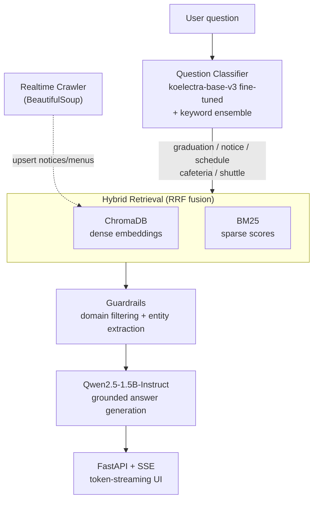

# CNU Campus ChatBot — RAG-Based Campus Assistant


[](https://github.com/leeyunseokarchive/CNU-Campus-ChatBot/actions/workflows/ci.yml)

A **RAG-based intelligent campus assistant** for Chungnam National University students, answering questions about graduation requirements, notices, academic schedules, cafeteria menus, and shuttle buses through a classify → retrieve → generate pipeline.

> Demo video: [`demo.mov`](./demo.mov) · Slides: [`presentation.pdf`](./presentation.pdf) *(Korean)*

---

## Highlights

- **Fine-tuned classifier, 99.3% validation accuracy** — `koelectra-base-v3` fine-tuned on 605 labeled questions, ensembled with keyword-based soft voting across 5 categories
- **Hybrid retrieval with RRF** — ChromaDB dense embeddings + BM25 sparse scores are fused with Reciprocal Rank Fusion, rather than relying on a single retrieval signal
- **Realtime knowledge base** — a BeautifulSoup crawler continuously upserts campus notices and cafeteria menus into the vector store, so answers don't go stale
- **Grounded generation with guardrails** — `Qwen2.5-1.5B-Instruct` generates answers strictly from retrieved evidence, with domain-filtering guardrails and entity extraction (dates, cafeteria names, etc.)
- **Streaming UX** — FastAPI + Server-Sent Events stream the answer token-by-token to the browser

## Features

| Task | Description |
|------|------|
| **1. Question classifier** | `koelectra-base-v3` fine-tuning + keyword ensemble (soft voting) routes questions into 5 categories (graduation / notice / schedule / cafeteria / shuttle) — **99.3%** validation accuracy |
| **2. RAG chatbot** | ChromaDB (dense) + BM25 (sparse) hybrid retrieval fused via RRF, then answer generation with `Qwen2.5-1.5B-Instruct` |
| **3. Realtime updates** | A BeautifulSoup crawler periodically collects campus notices/menus and upserts them into ChromaDB |
| **UI** | FastAPI + SSE token-streaming chatbot web UI |

## Architecture



## Tech Stack

- **Classifier**: `monologg/koelectra-base-v3-discriminator` fine-tuning (Hugging Face Transformers)
- **Retrieval (RAG)**: ChromaDB + sentence-transformers embeddings, rank-bm25, Reciprocal Rank Fusion (RRF)
- **LLM**: `Qwen/Qwen2.5-1.5B-Instruct`
- **Crawling**: requests + BeautifulSoup4 (realtime notices/menus)
- **Serving**: FastAPI + uvicorn, SSE streaming, HTML/CSS frontend

## Getting Started

```bash
# 1. Create a virtualenv and install dependencies
python3 -m venv .venv
source .venv/bin/activate
pip install -r requirements.txt

# 2. Run the full pipeline (KB indexing → output generation → UI server)
bash chatbot.sh
# → open http://localhost:7860
```

> **Note**: the fine-tuned classifier weights (`model.safetensors`) are excluded from this repo due to size.
> Run `src/classifier.ipynb` against `data/train_cls.json` to reproduce the same model into `model/classifier_finetuned/`.
> (training hyperparameters and results are in `model/classifier_finetuned/training_metadata.json`)

## Project Structure

```
.
├── data/
│   ├── train_cls.json          # classifier training data (605 rows)
│   ├── test_*.json             # per-task evaluation sets
│   └── kb/                     # knowledge base JSON (graduation/notice/schedule/cafeteria/shuttle)
│       └── realtime/           # realtime crawl output (notice / meal)
├── src/
│   ├── classifier.ipynb        # Task 1: classifier training notebook
│   ├── run_classifier.py       # batch classifier run
│   ├── run_chatbot.py          # Task 2/3: chatbot pipeline batch run
│   └── campus_chatbot/         # core modules
│       ├── classifier_model.py #   classifier load + ensemble
│       ├── retriever.py        #   ChromaDB + BM25 hybrid retrieval (RRF)
│       ├── indexer.py          #   knowledge base indexing
│       ├── llm_generator.py    #   Qwen LLM answer generation
│       ├── guardrails.py       #   out-of-domain question filtering
│       ├── entity.py           #   entity extraction (dates, cafeteria, etc.)
│       ├── smart_crawler.py    #   realtime notice/menu crawler
│       └── realtime.py         #   realtime data upsert pipeline
├── model/
│   └── classifier_finetuned/   # fine-tuned model config/tokenizer (weights require retraining)
├── scripts/rebuild_kb.py       # knowledge base rebuild
├── chatbot_ui.py               # FastAPI + SSE chatbot UI server
├── Demo.html                   # chatbot frontend
├── chatbot.sh                  # unified run script
└── requirements.txt
```

## Classifier Performance

| Metric | Value |
|------|-----|
| Base model | `monologg/koelectra-base-v3-discriminator` |
| Train / validation data | 605 / 152 rows |
| Epochs | 5 |
| **Validation accuracy** | **99.34%** |
| Eval loss | 0.234 |

## License

MIT — see [LICENSE](./LICENSE).
